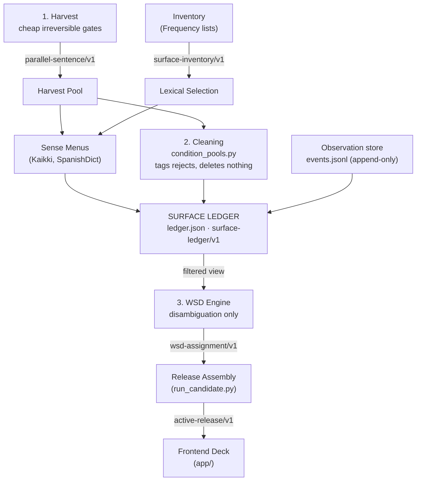

# Fluency-Next — Dense Codebase Map (AI Reference)

> **Purpose:** A dense, token-efficient index for AI coding assistants (Claude Code, OpenAI Codex, Antigravity). Read this file first instead of running exploratory search tools across the codebase. Concurrent **named chats** (deck campaign): **`CHAT_ROADMAP.md`** at repo root.

---

## 1. Core Invariants & Workspace Boundary

* **Load-Bearing Invariant:** A flashcard's identity is strictly the observed surface form: `card_id = f(language, surface_key)`. Never index or key cards by lemma, rank, or sense.
* **Absence is Declared, Never Inferred:** Missing data (menus, senses, examples) must be explicitly marked with status codes (`ineligible`, `no_menu`, `abstain`), not omitted.
* **Naming:** the GitHub repo is **`RabbiJoshy/Fluency-App`** (served at `rabbijoshy.github.io/Fluency-App/`); the local checkout is still the folder `Fluency-Next/`, which is why the `file://` links below are correct as written. Do not "fix" them. Release files live in a separate repo — see CLAUDE.md.
* **Two-Root Rule:**
  - `Fluency-Next/` (This local folder): Code, tests, configs, schemas, and compact release metadata.
  - `../Fluency-Workspace/`: Large datasets, corpora dumps, runs, pools, and generated releases. **Never put runs or large corpora in git.**
* **Search Boundary:** Ripgrep ignores `app/lyrics-audit/data/` and `research/**/results/`. Never run grep against raw JSON/JSONL datasets.

---

## 2. Backend Data Pipeline (`src/fluency/`)

Data flows through 5 strict, schema-validated stages:

**The ledger is the readiness contract.** A language is ready for WSD when its
ledger is complete; everything downstream reads it rather than reconstructing
it. Resolve its path with `fluency.surfaces.ledger.ledger_path()`, never as a
literal filename. See `docs/decisions/0021-*` and `docs/runbooks/surface-ledger.md`.

| Component | Directory | Primary Entry Point | Output / Schema |
| :--- | :--- | :--- | :--- |
| **Inventory** | `src/fluency/inventory/` | `runner.py`, `frequency_adapter.py` | `schemas/surface-inventory.schema.json` |
| **Harvest** | `src/fluency/harvest/` | `runner.py`, `tatoeba.py`, `opensubtitles.py` | `schemas/parallel-sentence.schema.json`, `schemas/harvest-pool.schema.json` |
| **Sense Menus** | `src/fluency/sense_menu/`| `kaikki.py` (multi-lang), `spanishdict.py` (es) | `schemas/sense-menu.schema.json` |
| **Features & Parity**| `src/fluency/features/`| `cognates.py`, `spanishdict.py`, `spanishdict_metadata.py` | Metadata projection & cross-lang cognates |
| **Surface ledger** | `src/fluency/surfaces/` | `events.py` (append-only log), `policy.py` (fold → verdict), `ledger.py` (path + contract) | `raw/surfaces/<lang>/ledger.json` |
| **WSD** | `src/fluency/wsd/` | `runner.py`, `importer.py` | `schemas/wsd-request-v2.schema.json`, `schemas/wsd-assignment.schema.json` |
| **Release** | `src/fluency/release/` | `run_candidate.py`, `metadata_upgrade.py` | `schemas/release-manifest.schema.json`, `schemas/active-release.schema.json` |
| **Conjugations** | `src/fluency/enrichments/` | `conjugations.py` (layer envelope), `kaikki_conjugations.py` (cs), `verbecc_conjugations.py` (pt/fr, ML off) | `schemas/conjugation-layer.schema.json` |
| **Lyrics & Artists**| `src/fluency/lyrics/` | `process.py`, `lexical.py`, `consolidate.py`, `audit.py` | `schemas/lyrics-consolidated-card.schema.json` |
| **CLI Dispatcher** | `src/fluency/cli/` | `registry.py`, `commands/` | Terminal commands (`fluency ...`) |

---

## 2b. Ledger Tooling (`scripts/`)

Operational scripts, run by hand rather than by the stage runner. Full sequence
in `docs/runbooks/surface-ledger.md`.

| Script | Does |
| :--- | :--- |
| `backfill_surface_events.py` | Derives observation events from artifacts already on disk |
| `observe_lemmas.py` | Resolves lemmas from every source, authority-first, with provenance |
| `materialise_surfaces.py` | Folds events through the policy table into `ledger.json` |
| `audit_surfaces_html.py` | Self-contained filterable HTML table of the ledger |
| `condition_pools.py` | The cleaning stage: alignment scoring, variety/hardness/length tags |
| `fetch_spanishdict.py` | Paced, resumable SpanishDict fetcher (0.35s, fsync per word) |
| `merge_spanishdict_refetch.py` | Merges refetches into a **new** snapshot, recomputing hashes |

---

## 3. Frontend Architecture & Global Registry (`app/`)

The frontend is a vanilla ES-module application (`app/index.html` $\rightarrow$ `app/js/main.js`) with **no build step**. Modules share functionality by attaching methods to `window`.

### Module Responsibility & `window.*` Map

| File | Primary Responsibility | Key Exposed `window` Functions |
| :--- | :--- | :--- |
| [app/js/flashcards.js](file:///Users/joshuathomasamar/PycharmProjects/Fluency-Next/app/js/flashcards.js) | Card rendering, flip, swipe, keyboard shortcuts, personal easiness. | `updateCard()`, `flipCard()`, `nextCard()`, `handleSwipeAction()`, `selectMeaning()`, `cycleExample()`, `loadConjugationData()` |
| [app/js/card-metadata-pills.js](file:///Users/joshuathomasamar/PycharmProjects/Fluency-Next/app/js/card-metadata-pills.js) | Sense metadata pills, grammar chips, qualifiers, canonical features. | `senseMetadataHTML()`, `senseMetadataItems()`, `toggleSenseMetadataChip()`, `toggleSenseMetadataOverflow()` |
| [app/js/flashcards-modals.js](file:///Users/joshuathomasamar/PycharmProjects/Fluency-Next/app/js/flashcards-modals.js) | Flag menu, breakdown modals, deck complete modal. | `openFlagMenu()`, `hideFlagMenu()`, `showLyricBreakdown()`, `hideLyricBreakdown()`, `showDeckCompleteModal()` |
| [app/js/flashcards-conj.js](file:///Users/joshuathomasamar/PycharmProjects/Fluency-Next/app/js/flashcards-conj.js) | Verb conjugation drawer rendering and tabs. | `toggleConjugationTable()`, `switchConjMood()`, `switchConjTense()` |
| [app/js/knowledge.js](file:///Users/joshuathomasamar/PycharmProjects/Fluency-Next/app/js/knowledge.js) | Card item knowledge state (Known / Review / Unseen). | `openCardKnowledgeModal()`, `getCardKnowledgeItems()`, `toggleKnowledgeItemState()`, `cacheItemProgress()` |
| [app/js/vocab.js](file:///Users/joshuathomasamar/PycharmProjects/Fluency-Next/app/js/vocab.js) | Deck and vocabulary loading. Speech setup reads skinny index columns; a set loads ~20 fat rows plus example shards and prefetches the next set. | `loadVocabularyData()`, `ensureExamplesForRange()`, `ensureIndexRowsForRange()`, `prefetchStudySetPayload()`, `LANG_CODES` |
| [app/js/ui.js](file:///Users/joshuathomasamar/PycharmProjects/Fluency-Next/app/js/ui.js) | Setup screen, study settings, theme colors, level selection. | `applyLanguageColorTheme()`, `openSetupView()`, `applyGlobalStudyDefaults()`, `renderStudySettings()` |
| [app/js/progress.js](file:///Users/joshuathomasamar/PycharmProjects/Fluency-Next/app/js/progress.js) | SRS stage transitions, coverage calculations. | `advanceSrsStage()`, `calculateCoveragePercent()`, `getProgressState()`, `getMergedWordProgress()` |
| [app/js/auth.js](file:///Users/joshuathomasamar/PycharmProjects/Fluency-Next/app/js/auth.js) | Guest mode, session persistence, sync queue, word flags. | `checkAuthentication()`, `enterGuestMode()`, `flagWord()`, `cacheProgressLocally()`, `flushProgressCache()` |
| [app/js/spotify.js](file:///Users/joshuathomasamar/PycharmProjects/Fluency-Next/app/js/spotify.js) | Spotify Web Playback SDK integration & playlist snippets. | `isSpotifyConnected()`, `playSpotifyTrackSnippet()`, `fetchSpotifyPlaylists()`, `cancelSpotifySnippet()` |
| [app/js/vocabulary-import.js](file:///Users/joshuathomasamar/PycharmProjects/Fluency-Next/app/js/vocabulary-import.js) | Vocabulary import & ChatGPT practice prompt hand-off. | `openVocabularyImportModal()`, `openChatGptPracticePrompt()` |
| [app/js/tutorial.js](file:///Users/joshuathomasamar/PycharmProjects/Fluency-Next/app/js/tutorial.js) | Learner **tutorial**: guided card tour from "?", first run and How to Study. Never opened from About. | `openCardTutorial()`, `openFirstRunCardTutorial()`, `closeCardTutorial()`, `setCardTutorialLanguage()` |
| [app/js/walkthrough.js](file:///Users/joshuathomasamar/PycharmProjects/Fluency-Next/app/js/walkthrough.js) | Visitor **walkthrough**: two-screen labelled card demo, opened only from About. | `openWalkthrough()`, `closeWalkthrough()` |
| [app/js/card-replica.js](file:///Users/joshuathomasamar/PycharmProjects/Fluency-Next/app/js/card-replica.js) | Replica card shared by tutorial and walkthrough: demo entries + live-card markup. No audience logic. | `REPLICA_CARDS`, `replicaCardHTML()`, `wireReplicaBack()`, `fitReplicaCard()` |
| [app/js/config.js](file:///Users/joshuathomasamar/PycharmProjects/Fluency-Next/app/js/config.js) | Active release capability flags & CEFR level config. | `loadConfig()`, `getCefrLevels()`, `getPercentageLevelRanges()` |
| [app/js/routes.js](file:///Users/joshuathomasamar/PycharmProjects/Fluency-Next/app/js/routes.js) | Shareable hash routing. **Never write `?artist=`, `?about=` or `?playlistLive=` in new code** — those are legacy and are rewritten on arrival. Use the helpers. | `goToRoute()`, `replaceRoute()` |

---

## 4. Key Schemas (`schemas/`)

When inspecting data structures, read the schema before reading sample JSON files:
* [schemas/card.schema.json](file:///Users/joshuathomasamar/PycharmProjects/Fluency-Next/schemas/card.schema.json) — Surface card identity and metadata.
* [schemas/sense-menu.schema.json](file:///Users/joshuathomasamar/PycharmProjects/Fluency-Next/schemas/sense-menu.schema.json) — Provider-agnostic sense menu specification.
* [schemas/wsd-request-v2.schema.json](file:///Users/joshuathomasamar/PycharmProjects/Fluency-Next/schemas/wsd-request-v2.schema.json) — Request format for sentence disambiguation.
* [schemas/wsd-assignment.schema.json](file:///Users/joshuathomasamar/PycharmProjects/Fluency-Next/schemas/wsd-assignment.schema.json) — Verified sense assignments.
* [schemas/active-release.schema.json](file:///Users/joshuathomasamar/PycharmProjects/Fluency-Next/schemas/active-release.schema.json) — Final release bundle served to the app.

---

## 5. Token Conservation Rules for AI Assistants

1. **Do not read [flashcards.js](file:///Users/joshuathomasamar/PycharmProjects/Fluency-Next/app/js/flashcards.js) or [style.css](file:///Users/joshuathomasamar/PycharmProjects/Fluency-Next/app/css/style.css) in full.** They are 7,600+ and 15,700+ lines. Use targeted line ranges (e.g. `updateCard` starts at line ~4200).
2. **Never search in `app/lyrics-audit/data/` or `research/**/results/`.** These are huge JSON/JSONL dumps.
3. **Check this map before grepping.** Consult the table above to find which file owns a function or global.
