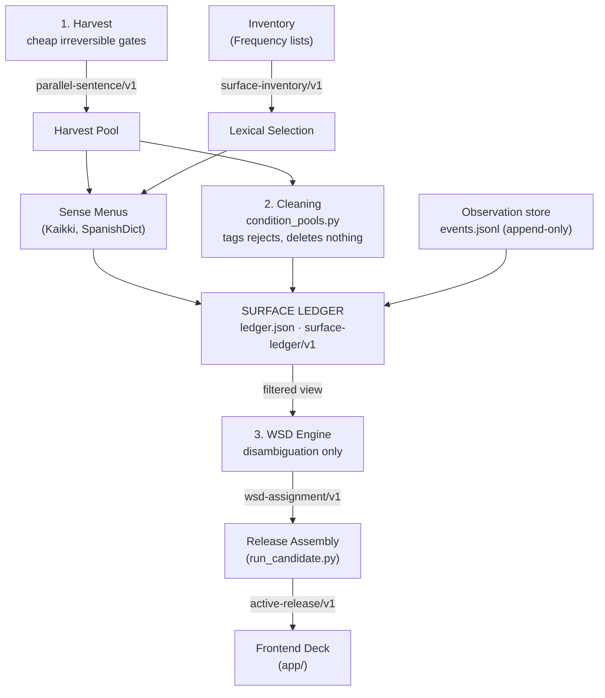

# Fluency-Next — Dense Codebase Map (AI Reference)

> **Purpose:** A dense, token-efficient index for AI coding assistants (Claude Code, OpenAI Codex, Antigravity). Read this file first instead of running exploratory search tools across the codebase. Concurrent **named chats** (deck campaign): **`CHAT_ROADMAP.md`** at repo root.

---

## 1. Core Invariants & Workspace Boundary

* **Load-Bearing Invariant:** A flashcard's identity is strictly the observed surface form: `card_id = f(language, surface_key)`. Never index or key cards by lemma, rank, or sense.
* **Absence is Declared, Never Inferred:** Missing data (menus, senses, examples) must be explicitly marked with status codes (`ineligible`, `no_menu`, `abstain`), not omitted.
* **Naming:** the GitHub repo is **`RabbiJoshy/Fluency-App`** (served at `rabbijoshy.github.io/Fluency-App/`); the local checkout is still the folder `Fluency-Next/`, which is why the `file://` links below are correct as written. Do not "fix" them. Release files live in a separate repo — see CLAUDE.md.
* **Two-Root Rule:**
  - `Fluency-Next/` (This local folder): Code, tests, configs, schemas, and compact release metadata.
  - `../Fluency-Workspace/`: Large datasets, corpora dumps, runs, pools, and generated releases. **Never put runs or large corpora in git.**
* **Search Boundary:** `.ignore` keeps search out of `app/lyrics-audit/data/`, `research/**/results/`, the large generated app data (`app/conjugation/data/`, cognate maps, merge exceptions, speech frequencies), the changelogs, `docs/archive/` and `scripts/archive/`. Never run grep against raw JSON/JSONL datasets.
* **History:** `docs/archive/` and `scripts/archive/` are history, not instructions. Open work is only the **Open** table in `CHAT_ROADMAP.md`.

---

## 2. Backend Data Pipeline (`src/fluency/`)

Data flows through 5 strict, schema-validated stages:

```mermaid
graph TD
    A["1. Harvest<br/>cheap irreversible gates"] -->|parallel-sentence/v1| B["Harvest Pool"]
    C["Inventory<br/>(Frequency lists)"] -->|surface-inventory/v1| D["Lexical Selection"]
    B & D --> E["Sense Menus<br/>(Kaikki, SpanishDict)"]
    B --> P["2. Cleaning<br/>condition_pools.py<br/>tags rejects, deletes nothing"]
    E & P & O["Observation store<br/>events.jsonl (append-only)"] --> L["SURFACE LEDGER<br/>ledger.json · surface-ledger/v1"]
    L -->|filtered view| F["3. WSD Engine<br/>disambiguation only"]
    F -->|wsd-assignment/v1| G["Release Assembly<br/>(run_candidate.py)"]
    G -->|active-release/v1| H["Frontend Deck<br/>(app/)"]
```

**The ledger is the readiness contract.** A language is ready for WSD when its
ledger is complete; everything downstream reads it rather than reconstructing
it. Resolve its path with `fluency.surfaces.ledger.ledger_path()`, never as a
literal filename. See `docs/decisions/0021-*` and `docs/runbooks/surface-ledger.md`.

| Component | Directory | Primary Entry Point | Output / Schema |
| :--- | :--- | :--- | :--- |
| **Inventory** | `src/fluency/inventory/` | `runner.py`, `frequency_adapter.py` | `schemas/surface-inventory.schema.json` |
| **Harvest** | `src/fluency/harvest/` | `runner.py`, `tatoeba.py`, `opensubtitles.py` | `schemas/parallel-sentence.schema.json`, `schemas/harvest-pool.schema.json` |
| **Sense Menus** | `src/fluency/sense_menu/`| `kaikki.py` (multi-lang), `spanishdict.py` (es) | `schemas/sense-menu.schema.json` |
| **Features & Parity**| `src/fluency/features/`| `cognates.py`, `spanishdict.py`, `spanishdict_metadata.py` | Metadata projection & cross-lang cognates |
| **Surface ledger** | `src/fluency/surfaces/` | `events.py` (append-only log), `policy.py` (fold → verdict), `ledger.py` (path + contract), `resolver.py` (headword set → strategy, one offline resolver for every provider), `declared.py` (hand-written entries: headwords/gloss/expansion/entity, scoped, trust-labelled), `stores.py` (language / artist / live stack, promotion), `trust.py` | `raw/surfaces/<lang>/ledger.json`; `config/declared/<lang>/*.json`; `config/surfaces/strategy.json` |
| **WSD** | `src/fluency/wsd/` | `runner.py`, `importer.py`; commit rule `commit.py` (dictionary order confirms the gloss, never vetoes it between analyses: `cross_analysis`, decision 0029); POS/lemma gates `languages/spanish.py` + `pos_bridge.py`; knobs per profile in `config/wsd/models/` (speech: newest `es`/`pt-v23-1`, `cs`/`fi-v21-1`; old profiles stay as release provenance) | `schemas/wsd-request-v2.schema.json`, `schemas/wsd-assignment.schema.json` |
| **Release** | `src/fluency/release/` | `run_candidate.py`, `metadata_upgrade.py` | `schemas/release-manifest.schema.json`, `schemas/active-release.schema.json` |
| **Speech WSD executor** | `src/fluency/speech/` | `wsd_execute.py`: runs a speech profile over a run dir and writes a bundle; `fluency pipeline wsd-import` publishes it to stage 04 | WSD bundle → `stages/04_wsd_assignments/` |
| **Reflexives** | `src/fluency/reflexive/` | `spanish.py`, `portuguese.py` (+ `spanish_base.py`, `paradigms.py`): tags X/Xse pair cards; only `NO_SE`/`SE_FIRM` filter WSD candidates (es/pt from v23). Eval harness + gold sets: `research/reflexives/` (keep) | candidate filter inside speech WSD |
| **Multi-word expressions** | `src/fluency/mwe/` | `builder.py` (phrase inventories), `policy.py`; curated lists `config/mwe/*-curated.json`, sign-off `config/mwe/SIGN_OFF.md` | MWE overlays read by `fluency.wsd.overlays` |
| **NLP models** | `src/fluency/nlp/` | `pos.py` (pinned spaCy POS), `embeddings.py` (resumable embedding cache), `models.py` (model registry/pins) | caches under the workspace |
| **Pipeline planning** | `src/fluency/pipeline/` | `planning.py` (`STAGE_INPUTS` diamond, `stages_invalidated_by()`), `budget.py` (spend projection) | run/stage manifests |
| **Conjugations** | `src/fluency/enrichments/` | `conjugations.py` (layer envelope), `kaikki_conjugations.py`: every language from Wiktionary/Kaikki since 2026-10-04 (verbecc and Jehle removed; es *-se* and compound tenses derived) | `schemas/conjugation-layer.schema.json` |
| **Lyrics & Artists**| `src/fluency/lyrics/`, `src/fluency/artist/` | `process.py`, `lexical.py`, `consolidate.py`, `audit.py`; `polyglot.py` (fr/pt Artist mode). **Lyrics WSD v20 is not in `fluency.wsd`:** it lives in `scripts/plant_artist_v20.py` with its own scorer (menus do come from the shared resolver). Merging it into the shared engine is **UNISON** | `schemas/lyrics-consolidated-card.schema.json` |
| **CLI Dispatcher** | `src/fluency/cli/` | `registry.py`, `commands/` | Terminal commands (`fluency ...`) |

---

## 2b. Ledger Tooling (`scripts/`)

Operational scripts, run by hand rather than by the stage runner. Full sequence
in `docs/runbooks/surface-ledger.md`.

| Script | Does |
| :--- | :--- |
| `backfill_surface_events.py` | Derives observation events from artifacts already on disk |
| `observe_lemmas.py` | Resolves lemmas from every source, authority-first, with provenance |
| `materialise_surfaces.py` | Folds events through the policy table into `ledger.json` |
| `audit_surfaces_html.py` | Self-contained filterable HTML table of the ledger |
| `condition_pools.py` | The cleaning stage: alignment scoring, variety/hardness/length tags |
| `fetch_spanishdict.py` | Paced, resumable SpanishDict fetcher (0.35s, fsync per word) |
| `merge_spanishdict_refetch.py` | Merges refetches into a **new** snapshot, recomputing hashes |

---

## 3. Frontend Architecture & Global Registry (`app/`)

The frontend is a vanilla ES-module application (`app/index.html` $\rightarrow$ `app/js/main.js`) with **no build step**. Modules share functionality by attaching methods to `window`.

### Module Responsibility & `window.*` Map

| File | Primary Responsibility | Key Exposed `window` Functions |
| :--- | :--- | :--- |
| [app/js/flashcards.js](file:///Users/joshuathomasamar/PycharmProjects/Fluency-Next/app/js/flashcards.js) | Card rendering, flip, swipe, keyboard shortcuts, personal easiness. | `updateCard()`, `flipCard()`, `nextCard()`, `handleSwipeAction()`, `selectMeaning()`, `cycleExample()`, `loadConjugationData()` |
| [app/js/card-metadata-pills.js](file:///Users/joshuathomasamar/PycharmProjects/Fluency-Next/app/js/card-metadata-pills.js) | Sense metadata pills, grammar chips, qualifiers, canonical features. | `senseMetadataHTML()`, `senseMetadataItems()`, `toggleSenseMetadataChip()`, `toggleSenseMetadataOverflow()` |
| [app/js/flashcards-modals.js](file:///Users/joshuathomasamar/PycharmProjects/Fluency-Next/app/js/flashcards-modals.js) | Flag menu, breakdown modals, deck complete modal. | `openFlagMenu()`, `hideFlagMenu()`, `showLyricBreakdown()`, `hideLyricBreakdown()`, `showDeckCompleteModal()` |
| [app/js/flashcards-conj.js](file:///Users/joshuathomasamar/PycharmProjects/Fluency-Next/app/js/flashcards-conj.js) | Verb conjugation drawer rendering and tabs. | `toggleConjugationTable()`, `switchConjMood()`, `switchConjTense()` |
| [app/js/knowledge.js](file:///Users/joshuathomasamar/PycharmProjects/Fluency-Next/app/js/knowledge.js) | Card item knowledge state (Known / Review / Unseen). | `openCardKnowledgeModal()`, `getCardKnowledgeItems()`, `toggleKnowledgeItemState()`, `cacheItemProgress()` |
| [app/js/vocab.js](file:///Users/joshuathomasamar/PycharmProjects/Fluency-Next/app/js/vocab.js) | Deck and vocabulary loading. Speech setup reads skinny index columns; a set loads ~20 fat rows plus example shards and prefetches the next set. | `loadVocabularyData()`, `ensureExamplesForRange()`, `ensureIndexRowsForRange()`, `prefetchStudySetPayload()`, `LANG_CODES` |
| [app/js/ui.js](file:///Users/joshuathomasamar/PycharmProjects/Fluency-Next/app/js/ui.js) | Setup screen, study settings, theme colors, level selection. | `applyLanguageColorTheme()`, `openSetupView()`, `applyGlobalStudyDefaults()`, `renderStudySettings()` |
| [app/js/progress.js](file:///Users/joshuathomasamar/PycharmProjects/Fluency-Next/app/js/progress.js) | SRS stage transitions, coverage calculations. | `advanceSrsStage()`, `calculateCoveragePercent()`, `getProgressState()`, `getMergedWordProgress()` |
| [app/js/auth.js](file:///Users/joshuathomasamar/PycharmProjects/Fluency-Next/app/js/auth.js) | Guest mode, session persistence, sync queue, word flags. | `checkAuthentication()`, `enterGuestMode()`, `flagWord()`, `cacheProgressLocally()`, `flushProgressCache()` |
| [app/js/spotify.js](file:///Users/joshuathomasamar/PycharmProjects/Fluency-Next/app/js/spotify.js) | Spotify Web Playback SDK integration & playlist snippets. | `isSpotifyConnected()`, `playSpotifyTrackSnippet()`, `fetchSpotifyPlaylists()`, `cancelSpotifySnippet()` |
| [app/js/vocabulary-import.js](file:///Users/joshuathomasamar/PycharmProjects/Fluency-Next/app/js/vocabulary-import.js) | Vocabulary import & ChatGPT practice prompt hand-off. | `openVocabularyImportModal()`, `openChatGptPracticePrompt()` |
| [app/js/tutorial.js](file:///Users/joshuathomasamar/PycharmProjects/Fluency-Next/app/js/tutorial.js) | Learner **tutorial**: three chapters (studying a card, Smart Skip, speech or music), each ending in "Start studying"; from "?", first run and How to Study. Never opened from About. | `openCardTutorial()`, `openFirstRunCardTutorial()`, `closeCardTutorial()`, `setCardTutorialLanguage()` |
| [app/js/walkthrough.js](file:///Users/joshuathomasamar/PycharmProjects/Fluency-Next/app/js/walkthrough.js) | Visitor **walkthrough**: two-screen labelled card demo, opened only from About. | `openWalkthrough()`, `closeWalkthrough()` |
| [app/js/card-replica.js](file:///Users/joshuathomasamar/PycharmProjects/Fluency-Next/app/js/card-replica.js) | Replica card shared by tutorial and walkthrough: demo entries + live-card markup. No audience logic. | `REPLICA_CARDS`, `replicaCardHTML()`, `wireReplicaBack()`, `fitReplicaCard()` |
| [app/js/config.js](file:///Users/joshuathomasamar/PycharmProjects/Fluency-Next/app/js/config.js) | Active release capability flags & CEFR level config. | `loadConfig()`, `getCefrLevels()`, `getPercentageLevelRanges()` |
| [app/js/state.js](file:///Users/joshuathomasamar/PycharmProjects/Fluency-Next/app/js/state.js) | Shared mutable app state, also exposed on `globalThis`. | (bare globals) |
| [app/js/main.js](file:///Users/joshuathomasamar/PycharmProjects/Fluency-Next/app/js/main.js) | Boot: legacy-link rewrite, flags, lazy Spotify import, wiring. | — |
| [app/js/release-host.js](file:///Users/joshuathomasamar/PycharmProjects/Fluency-Next/app/js/release-host.js) | Maps `releases/<segment>/…` to that segment's `Fluency-Releases-<segment>` site. | `releaseUrl()` (export) |
| [app/js/data-contracts.js](file:///Users/joshuathomasamar/PycharmProjects/Fluency-Next/app/js/data-contracts.js) | Runtime guards on generated release data. | — |
| [app/js/coverage.js](file:///Users/joshuathomasamar/PycharmProjects/Fluency-Next/app/js/coverage.js) | What a level is worth (coverage per rank band). | — |
| [app/js/estimation.js](file:///Users/joshuathomasamar/PycharmProjects/Fluency-Next/app/js/estimation.js) | Level check / placement (always on the Speech vocabulary). | `openEstimationModal()`, `handleAnswer()` |
| [app/js/fast-mode.js](file:///Users/joshuathomasamar/PycharmProjects/Fluency-Next/app/js/fast-mode.js), [fast-track-preferences.js](file:///Users/joshuathomasamar/PycharmProjects/Fluency-Next/app/js/fast-track-preferences.js) | Fast mode setup page; one Fast Track choice per language (Merge Lemmas, Exclude Cognates…). | — |
| [app/js/extras.js](file:///Users/joshuathomasamar/PycharmProjects/Fluency-Next/app/js/extras.js) | Extras: words the current settings keep out of the deck, still browsable. | — |
| [app/js/cognates.js](file:///Users/joshuathomasamar/PycharmProjects/Fluency-Next/app/js/cognates.js) | Known languages and per-word transparency (Exclude Cognates). | — |
| [app/js/grammar-cards.js](file:///Users/joshuathomasamar/PycharmProjects/Fluency-Next/app/js/grammar-cards.js) | Display-only sibling-sense collapse for function words (*lo*, *de*, *que*); does not re-score WSD. | — |
| [app/js/reverse-cues.js](file:///Users/joshuathomasamar/PycharmProjects/Fluency-Next/app/js/reverse-cues.js) | English-first cue selection and English inflection (`finiteEnglishCue`). | — |
| [app/js/spanishdict-usage.js](file:///Users/joshuathomasamar/PycharmProjects/Fluency-Next/app/js/spanishdict-usage.js) | Presents SpanishDict sense usage notes. | — |
| [app/js/example-personalisation.js](file:///Users/joshuathomasamar/PycharmProjects/Fluency-Next/app/js/example-personalisation.js) | Ranks examples containing words due for review. | — |
| [app/js/review-home.js](file:///Users/joshuathomasamar/PycharmProjects/Fluency-Next/app/js/review-home.js) | Practice page: explains the review queue (queue itself is `progress.js`). | — |
| [app/js/progress-identity.js](file:///Users/joshuathomasamar/PycharmProjects/Fluency-Next/app/js/progress-identity.js) | Pure progress-ID helpers incl. the historical-ID bridge. | — |
| [app/js/sync-queue.js](file:///Users/joshuathomasamar/PycharmProjects/Fluency-Next/app/js/sync-queue.js), [offline-db.js](file:///Users/joshuathomasamar/PycharmProjects/Fluency-Next/app/js/offline-db.js), [offline-content.js](file:///Users/joshuathomasamar/PycharmProjects/Fluency-Next/app/js/offline-content.js) | Local-first sync queue, IndexedDB storage, offline deck downloads. | `renderOfflineContent()` |
| [app/js/vocabulary-import-core.js](file:///Users/joshuathomasamar/PycharmProjects/Fluency-Next/app/js/vocabulary-import-core.js) | Pure parse/merge rules for the known-word importer (UI in `vocabulary-import.js`). | — |
| [app/js/song-sets.js](file:///Users/joshuathomasamar/PycharmProjects/Fluency-Next/app/js/song-sets.js), [song-sets-core.js](file:///Users/joshuathomasamar/PycharmProjects/Fluency-Next/app/js/song-sets-core.js) | Artist mode: choose songs, filter cards/examples to them (core = pure). | `clearActiveExamplesData()` |
| [app/js/artist-ui.js](file:///Users/joshuathomasamar/PycharmProjects/Fluency-Next/app/js/artist-ui.js) | Album art and artist backgrounds. | `getAlbumImageForSong()`, `updateArtistBackground()` |
| [app/js/spotify-playlist-import.js](file:///Users/joshuathomasamar/PycharmProjects/Fluency-Next/app/js/spotify-playlist-import.js), [playlist-live.js](file:///Users/joshuathomasamar/PycharmProjects/Fluency-Next/app/js/playlist-live.js) | SETLIST: Spotify playlist → LRCLIB lyrics → naive live deck (speech inventory, unassigned song lines). | `openSpotifyPlaylistImport()`, `buildPlaylistLiveDeck()` |
| [app/turbo/](file:///Users/joshuathomasamar/PycharmProjects/Fluency-Next/app/turbo/) | **TURBO** (in progress): live in-browser playlist WSD engine (`turbo-engine.js`). | — |
| [app/js/speech.js](file:///Users/joshuathomasamar/PycharmProjects/Fluency-Next/app/js/speech.js) | Text-to-speech voice choice and rate. | `speakWord()`, `setVoice()` |
| [app/js/keyboard-guide.js](file:///Users/joshuathomasamar/PycharmProjects/Fluency-Next/app/js/keyboard-guide.js), [side-dock.js](file:///Users/joshuathomasamar/PycharmProjects/Fluency-Next/app/js/side-dock.js), [theme.js](file:///Users/joshuathomasamar/PycharmProjects/Fluency-Next/app/js/theme.js), [flags.js](file:///Users/joshuathomasamar/PycharmProjects/Fluency-Next/app/js/flags.js) | Shortcut reference; desktop side docking; light/dark theme; SVG flags. | `sideDock` |
| [app/js/routes.js](file:///Users/joshuathomasamar/PycharmProjects/Fluency-Next/app/js/routes.js) | Shareable hash routing. **Never write `?artist=`, `?about=` or `?playlistLive=` in new code** — those are legacy and are rewritten on arrival. Use the helpers. | `goToRoute()`, `replaceRoute()` |

---

## 4. Key Schemas (`schemas/`)

When inspecting data structures, read the schema before reading sample JSON files:
* [schemas/card.schema.json](file:///Users/joshuathomasamar/PycharmProjects/Fluency-Next/schemas/card.schema.json) — Surface card identity and metadata.
* [schemas/sense-menu.schema.json](file:///Users/joshuathomasamar/PycharmProjects/Fluency-Next/schemas/sense-menu.schema.json) — Provider-agnostic sense menu specification.
* [schemas/wsd-request-v2.schema.json](file:///Users/joshuathomasamar/PycharmProjects/Fluency-Next/schemas/wsd-request-v2.schema.json) — Request format for sentence disambiguation.
* [schemas/wsd-assignment.schema.json](file:///Users/joshuathomasamar/PycharmProjects/Fluency-Next/schemas/wsd-assignment.schema.json) — Verified sense assignments.
* [schemas/active-release.schema.json](file:///Users/joshuathomasamar/PycharmProjects/Fluency-Next/schemas/active-release.schema.json) — Final release bundle served to the app.

---

## 5. Token Conservation Rules for AI Assistants

1. **Do not read [flashcards.js](file:///Users/joshuathomasamar/PycharmProjects/Fluency-Next/app/js/flashcards.js) or [style.css](file:///Users/joshuathomasamar/PycharmProjects/Fluency-Next/app/css/style.css) in full.** They are ~10,500 and ~22,700 lines. Use targeted line ranges (e.g. `updateCard` starts at line ~5900).
2. **Never search in `app/lyrics-audit/data/`, `research/**/results/` or `app/conjugation/data/`.** These are huge generated dumps.
3. **Check this map before grepping.** Consult the table above to find which file owns a function or global.
