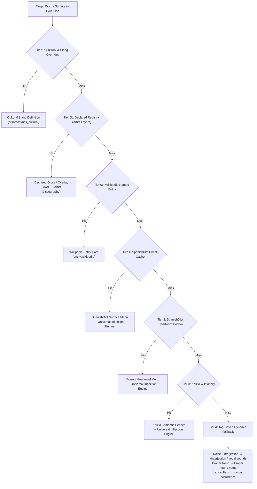

# Spanish Lyrics WSD Pipeline & Hierarchy

This document specifies the authoritative sense-menu resolution hierarchy, inflection rules, and token boundaries for **Spanish Lyrics Mode** (v19+).

---

## 1. The Resolution Tiers

### Tier 0: Cultural & Slang Overrides
* **Authority**: Scoped Puerto Rican / Caribbean urban slang and cultural terminology.
* **Examples**: *bellacoso* ("horny / freaky"), *guayando* ("grinding / dancing close"), *bichote* ("drug kingpin / big boss").
* **Behavior**: Deterministic match. Bypasses general-purpose dictionary definitions.

### Tier 0b: Declared Registry (Artist Layers)
* **Authority**: GRAFT overlays and artist-specific albums, tracks, and recurring slogans (`config/declared/`).
* **Behavior**: Scoped overlay that either injects a priority sense or competes in WSD.

### Tier 0c: Wikipedia Named Entity Resolver
* **Authority**: Local Wikipedia cache and entity stores.
* **Examples**: *Santurce*, *Bayamón*, *Ferrari*, *Bugatti*.
* **Behavior**: Detects proper nouns, geography, brands, and real-world figures. Renders a clickable Wikipedia icon at the card header.

### Tier 1: SpanishDict Direct Cache (`surface_cache.json`)
* **Authority**: Standard SpanishDict scrape cache for exact surface lookups.
* **Important Invariant**: All verb forms (finite, participles, gerunds) and plural nouns **must pass through `inflect_card_senses()`** to adapt the citation definition (e.g. *perreando* $\to$ *"twerking"*, not *"to twerk"*).

### Tier 2: SpanishDict Headword Borrowing
* **Trigger**: When the surface is an inflected verb or plural noun not catalogued as a standalone surface page.
* **Resolution Path**:
  1. `conjugation_reverse.json` (137,845 inflected verb forms).
  2. Kaikki Wiktionary `form_of` links.
  3. spaCy TRF Transformer Lemmatizer.
* **Behavior**: Borrows the headword's semantic menu and runs `inflect_card_senses()` with the target surface and grammatical person/number.

### Tier 3: Kaikki Wiktionary
* **Trigger**: Words absent from SpanishDict (rare vocabulary, regional expressions, modern coinages).
* **Behavior**: Extracts English definitions, discarding meta-grammatical glosses (`"second-person singular imperative of..."`). Runs `inflect_card_senses()`.

### Tier 4: Tag-Driven Dynamic Fallback
* **Trigger**: Uncatalogued tokens absent from all dictionaries.
* **Rule**: Reads card metadata tags (`extra_category`, `is_noise`, `is_interjection`, `is_propernoun`, `pos`):
  * **Interjection / Noise**: `(interjection / vocal sound)`, POS `INTJ`.
  * **Proper Noun**: Raw token, Context `Proper noun / name`, POS `PROPN`.
  * **Lexical**: Raw token, Context `Lyrical occurrence`, POS `NOUN`.

---

## 2. Token Boundaries & Elisions

1. **Exact Token Indexing**:
   The corpus line index preserves exact tokens (including apostrophes) as written in the lyrics.
2. **No Blind Apostrophe Stripping**:
   Apostrophes representing dropped `-s` (*busca'*, *tiene'*, *quiere'*) must **never** be stripped during search. Dropping the apostrophe morphologically collapses 2nd-person singular (*tú buscas*) into 3rd-person singular (*él busca*) or nouns (*en busca de*).
3. **Explicit Variants**:
   Alternations like *pa'* $\leftrightarrow$ *pa* or *to'* $\leftrightarrow$ *to* must be listed as explicit card variants, never inferred by destructive string substitution.
